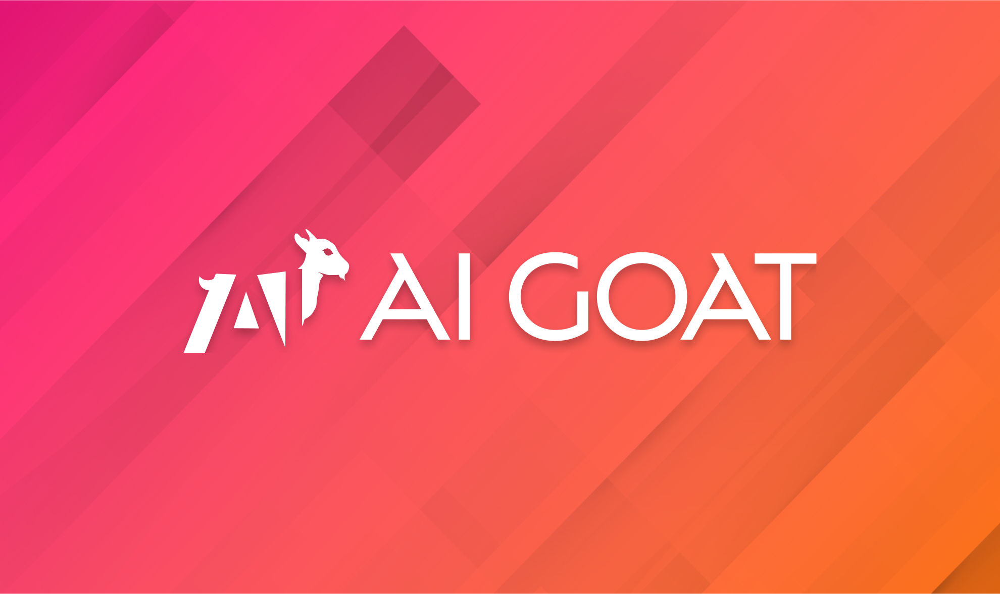
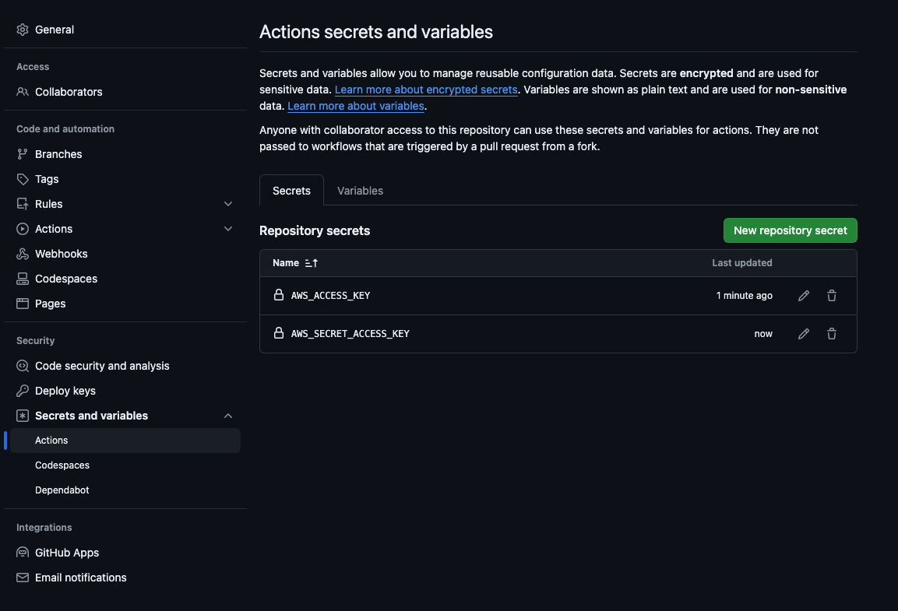
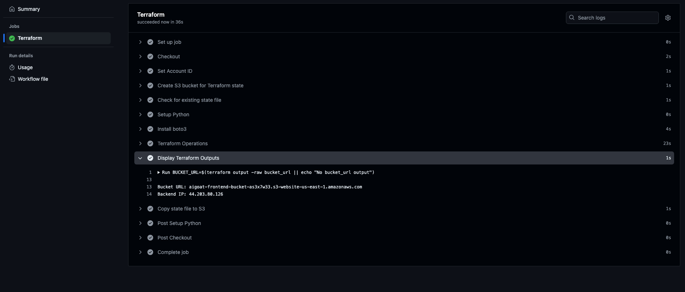
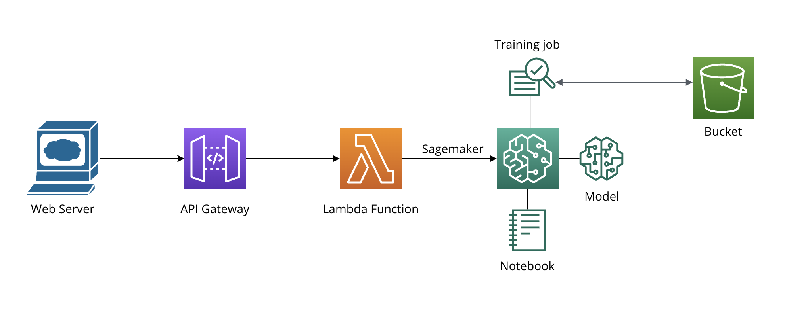

# AIGoat : A Deliberately Vulnerable AI Infrastructure


<div align="center">
  
</div>

## Table of Contents

* [Description](#Description)
  * [Tech Stack](#Tech-Stack)
  * [Vulnerabilities](#Vulnerabilities)
* [Getting Started](#Getting-Started)
  * [Prerequisites](#Prerequisites)
  * [Usage](#Usage)
  * [Manual Installation](#Manual-Installation)
* [Challenges](#Challenges)
* [Hints](#Hints)
* [Solutions](#Solutions)
* [Pricing](#Pricing)
* [Contributors](#Contributors)
* [Presented at](#Presented-at)
* [Contribution Guidelines](#Contribution-Guidelines)

# Description

With the rise of AI infrastructures, the rise of attacks on such vulnerable infrastructure is inevitable. Insecure AI infrastructure can expose organizations to significant risks, including data breaches and manipulation of AI-driven decisions. Often, these vulnerabilities arise from misconfigurations or overlooked security flaws in AI models, applications and deployment environments.

AI-Goat is a deliberately vulnerable AI infrastructure hosted on AWS, designed to simulate the [OWASP Machine Learning Security Top 10 risks](https://owasp.org/www-project-machine-learning-security-top-10/) (OWASP ML Top 10). AI-Goat replicates real-world AI cloud deployment environments but introduces vulnerabilities intentionally to provide a realistic learning platform. It features multiple attack vectors and is focused on a black-box testing approach.
By using AI-Goat, users can learn and practice:

AI Security Testing/Red-teaming<br />
AI Infrastructure as Code<br />
Understanding vulnerabilities in AI application infrastructure<br />
Identifying risks in the services and tools that interact with AI applications

The project is structured into modules, representing a distinct AI application with different tech stacks. AI-Goat leverages IaC through Terraform and GitHub Actions to simplify the deployment process.

## Tech Stack

* AWS
* React
* Python 3
* Terraform

## Vulnerabilities

The project aims to cover all major vulnerabilities in the OWASP Machine Learning Security Top 10.
Currently, the project includes the following vulnerabilities/risks:

* ML02:2023 Data Poisoning Attack
* ML06:2023 AI Supply Chain Attacks
* ML09:2023 Output Integrity Attack

# Getting Started

### Prerequisites
* An AWS Account + AWS Access Key with Administrative Privileges

### Usage

To simplify the deployment process, users can fork this repository, add their AWS account credentials to GitHub secrets, and run the Terraform Apply Action. This workflow will deploy the entire infrastructure and provide the URL of the hosted application.

Here are the steps to follow:

**1.** Fork the repo

**2.** Set the GitHub Action Secrets inside settings/secrets with the following keys:

```
AWS_ACCESS_KEY
AWS_SECRET_ACCESS_KEY
```

<p align="center">
  
</p>

**Step 3.** From the repository actions tab run the ``Terraform Apply`` Workflow.

**Step 4.** Find the application URL in the Terraform output section.

<div align="center">
  
</div>

### Manual Installation

If you wish to manually deploy AIGoat, follow these steps:

**Step 1.** Clone the repo
```sh
git clone https://github.com/orcasecurity-research/AIGoat
```

**Step 2.** Configure AWS User Account Credentials
```sh
aws configure
```

**Step 3.** Traverse into the terraform directory and use terraform to deploy AIGoat
```sh
cd terraform
terraform init
terraform apply --auto-approve
```


# Challenges

All challenges within AI-Goat are part of a toy store application featuring different machine learning functionalities. Each challenge is designed to demonstrate specific vulnerabilities from the OWASP Machine Learning Security Top 10 risks.

**Machine Learning Modules Architecture:**
<div align="center">
  
</div>


**Challenge 1:** AI Supply Chain Attacks
This challenge features a product search page within the application. Users can upload an image, and the ML model calculates and displays the most similar products. 
This module highlights vulnerabilities in the AI supply chain, where attackers can compromise the pipeline due to a vulnerable package.<br />
**Goal:** Compromise the product search functionality using the file upload option to get the sensitive information file.

**Challenge 2:** Data Poisoning Attack
This challenge involves a custom product recommendations model. When a user is logged in, the cart page displays personalized product recommendations. 
The challenge showcases vulnerabilities in the AI model training process and dataset, allowing attackers to poison the data and manipulate recommendations.<br />
###### Login with these credentials to view the recommendations: 
```
user: babyshark
password: doodoo123
```
**Goal:** Manipulate the AI model to recommend a product - Orca Doll, which is not visible in the catalog for the provided user.

** Note: When attempting to upload bucket resources using AWS CLI, you will need to use the flag --acl bucket-owner-full-control since the bucket enforces it **

**Challenge 3:** Output Integrity Attack
For this challenge, the application features a content and spam filtering AI system that checks each comment a user attempts to add to a product page. The AI determines whether the comment is allowed or not. This module demonstrates vulnerabilities in the model output integrity, where attackers can manipulate the AI system to bypass content filtering.<br />

**Goal:** Bypass the content filtering AI system to post on the Orca Doll product page the forbidden comment: 
``` 
"pwned"
``` 
Success is achieved this comment that should be filtered gets published.


# Hints

If you feel like you're stuck and want some help - we created hints for each challenge. To access the hints, you can use the following API endpoints:

<backend_ip>/hints/challenge1/<1,2,3><br />
<backend_ip>/hints/challenge2/<1,2,3><br />
<backend_ip>/hints/challenge3/<1,2,3><br />

** The backend_ip could be found in the Terraform output section or by viewing the IP address in the website's API requests.

# Solutions

Spoiler alert! Avoid browsing the repository files as they contain spoilers :smiley:.

The solutions are available in the [solutions](solutions/) directory.


# Pricing

The resources created with the deployment of AIGoat will have the following charges for the US-East region: 

Average of: **$0.13/hour**


# Contributors

Ofir Yakobi, Security Researcher, Orca Security  <ofir.yakobi@orca.security>

Shir Sadon, Security Researcher, Orca Security <shir.sadon@orca.security>

## Presented at

- [Appsec Village DC 32: Arsenal](https://www.appsecvillage.com/events/dc-2024/arsenal-ai-goat-707694)
- [OWASP Global AppSec San Francisco 2024](https://owasp2024globalappsecsanfra.sched.com/event/1g3Ym/ai-goat-a-damn-vulnerable-ai-infrastructure)

## Contribution Guidelines

* Contributions in the form of code improvements, module updates, feature improvements, and any general suggestions are welcome. 
* Improvements to the functionalities of the current modules are also welcome. 
* The source code for each module can be found in ``terraform/modules/<module_name>/main.tf`` this can be used to modify the existing application code.
